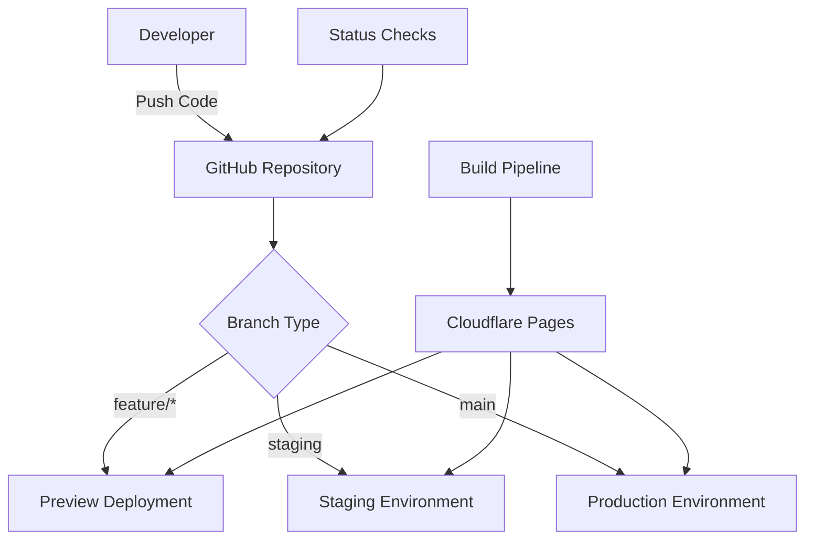

# Feature Documentation: Next.js TypeScript Project with Cloudflare Pages CI/CD

**Document Type**: Technical Feature Documentation  
**Created**: 2025-09-10  
**Version**: 1.0.0  
**For**: Development teams and system administrators

## Feature Overview

This documentation describes the complete CI/CD pipeline implementation for a Next.js TypeScript project using GitHub and Cloudflare Pages. The system provides automated testing, building, and deployment with proper staging workflows and branch protection.

## Architecture Overview

### System Components



### Core Components

1. **Next.js 14.x Application**: React-based web application with TypeScript
2. **GitHub Repository**: Source code management with branch protection
3. **Cloudflare Pages**: Static site hosting with global CDN
4. **Build Pipeline**: Automated testing, linting, and building
5. **Branch Strategy**: Three-tier deployment workflow

## Deployment Workflow

### Branch Strategy

| Branch Type | Purpose | Deployment Target | URL Pattern |
|-------------|---------|-------------------|-------------|
| `main` | Production | Production environment | `https://cpaonweb.com` |
| `staging` | Pre-production testing | Staging environment | `https://staging.cpaonweb.com` |
| `feature/*` | Feature development | Preview deployments | `https://[hash].cpaonweb.pages.dev` |

### Deployment Pipeline

#### Feature Development Flow
1. **Create Feature Branch**: `git checkout -b feature/new-feature`
2. **Develop and Test**: Local development with hot reload
3. **Push Changes**: `git push origin feature/new-feature`  
4. **Preview Deployment**: Automatic deployment to preview URL
5. **Create Pull Request**: Request merge to staging branch
6. **Code Review**: Required before merge approval
7. **Status Checks**: All checks must pass before merge

#### Staging Flow
1. **Merge to Staging**: Feature branch merged to `staging`
2. **Staging Deployment**: Automatic deployment to staging environment
3. **Integration Testing**: Manual or automated testing in staging
4. **Production Promotion**: Create PR from staging to main

#### Production Flow
1. **Merge to Main**: Staging branch merged to `main`
2. **Production Deployment**: Automatic deployment to production
3. **Health Checks**: Verify deployment success
4. **Monitoring**: Ongoing monitoring and alerts

## Build Pipeline Details

### Build Process

The build pipeline executes these steps for every deployment:

1. **Environment Setup**
   ```bash
   Node.js version: 18.x LTS
   Package manager: npm
   Build timeout: 10 minutes
   ```

2. **Dependency Installation**
   ```bash
   npm ci  # Clean install from package-lock.json
   ```

3. **Code Quality Checks**
   ```bash
   npm run type-check  # TypeScript compilation
   npm run lint        # ESLint code analysis
   ```

4. **Application Build**
   ```bash
   npm run build       # Next.js production build
   ```

5. **Asset Deployment**
   - Static files uploaded to Cloudflare CDN
   - Cache headers configured for optimal performance

### Environment Variables

| Variable | Value | Purpose |
|----------|-------|---------|
| `NODE_ENV` | `production` | Runtime environment |
| `NEXT_TELEMETRY_DISABLED` | `1` | Disable Next.js telemetry |
| Custom variables | As needed | Application configuration |

### Status Checks

Required status checks for protected branches:

- **build**: Application builds successfully
- **type-check**: No TypeScript errors
- **lint**: Code passes ESLint rules

## Security Implementation

### Branch Protection Rules

**Main Branch Protection:**
- Require pull request reviews (1 approver minimum)
- Require status checks to pass
- Require branches to be up to date before merging
- Restrict pushes that create files larger than 100 MB
- Include administrators in restrictions
- Allow force pushes: ❌
- Allow deletions: ❌

**Staging Branch Protection:**
- Same rules as main branch
- Ensures quality control for pre-production

### Access Control

**Repository Access Levels:**
- **Admin**: Repository owners and lead developers
- **Write**: Team members who can create branches and PRs
- **Read**: Contractors or external collaborators

**Cloudflare Pages Access:**
- Project administrators can modify build settings
- Deployment history visible to authorized users
- Environment variables secured and encrypted

### Security Best Practices

1. **Secrets Management**: Use environment variables, never commit secrets
2. **Dependency Security**: Regular npm audit and security updates
3. **SSL/TLS**: Automatic HTTPS with Cloudflare Universal SSL
4. **Content Security**: Security headers configured via Cloudflare
5. **Access Logs**: Monitor deployment and access patterns

## Performance Characteristics

### Build Performance

| Metric | Target | Typical |
|--------|--------|---------|
| Build Time | < 10 minutes | 3-5 minutes |
| Dependency Install | < 5 minutes | 1-2 minutes |
| Type Check | < 2 minutes | 30 seconds |
| Lint Check | < 1 minute | 15 seconds |

### Runtime Performance

| Metric | Target | Implementation |
|--------|--------|----------------|
| First Contentful Paint | < 1.5s | Static site generation |
| Time to Interactive | < 3s | Code splitting and lazy loading |
| Core Web Vitals | Pass all | Optimized assets and caching |
| Global Coverage | 99%+ | Cloudflare's 200+ edge locations |

### Caching Strategy

**Static Assets:**
- Cache-Control: `public, max-age=31536000` (1 year)
- Immutable content with versioned filenames

**HTML Pages:**
- Cache-Control: `public, max-age=0, must-revalidate`
- Fresh content with CDN edge caching

**API Routes** (if applicable):
- Configurable caching based on content type
- Support for ISR (Incremental Static Regeneration)

## Monitoring and Observability

### Key Metrics

**Deployment Metrics:**
- Deployment frequency (target: multiple times per day)
- Build success rate (target: > 95%)
- Mean time to deployment (target: < 10 minutes)
- Failed deployment recovery time (target: < 15 minutes)

**Application Metrics:**
- Page load times across global regions
- Error rates and types
- Core Web Vitals scores
- User experience metrics

### Alerting

**Build Failures:**
- GitHub commit status updates
- Email notifications (configurable)
- Slack/Discord webhooks (optional)

**Runtime Issues:**
- Cloudflare Analytics for performance monitoring
- Custom monitoring via Web Analytics API
- Third-party monitoring services (DataDog, New Relic, etc.)

### Logging

**Build Logs:**
- Complete build output available in Cloudflare Pages
- Structured logging with timestamps
- Error context and stack traces
- Retention: 30 days

**Application Logs:**
- Client-side error tracking via browser APIs
- Server-side request logs (if using API routes)
- Custom event tracking for business metrics

## Disaster Recovery and Rollback

### Rollback Procedures

**Immediate Rollback (< 1 minute):**
1. Access Cloudflare Pages dashboard
2. Navigate to Deployments tab
3. Select previous successful deployment
4. Click "Promote to production"

**Git-based Rollback (5-10 minutes):**
```bash
# Identify problematic commit
git log --oneline -10

# Revert the commit
git revert [commit-hash]

# Push revert commit
git push origin main
```

**Emergency Rollback:**
- Cloudflare Pages allows instant rollback to any previous deployment
- No re-build required for previously successful deployments
- DNS changes can be made if complete service restoration needed

### Backup Strategy

**Source Code:**
- Primary: GitHub repository with full history
- Secondary: Local developer clones
- Tertiary: GitHub's backup systems

**Configuration:**
- Environment variables documented in team knowledge base
- Infrastructure as Code approach for reproducibility
- Configuration templates stored in repository

**Deployment History:**
- Cloudflare Pages retains 100 most recent deployments
- Build artifacts available for 90 days
- Deployment metadata and logs archived

## Testing Procedures

### Pre-deployment Testing

**Automated Testing:**
1. **Unit Tests**: Component and utility function testing
2. **Integration Tests**: API and service integration verification  
3. **Build Tests**: Successful compilation and build completion
4. **Lint Tests**: Code quality and style consistency

**Manual Testing Checklist:**
- [ ] Local development environment starts successfully
- [ ] All pages load without errors
- [ ] TypeScript compilation passes
- [ ] Build process completes without warnings
- [ ] Preview deployment accessible and functional

### Post-deployment Verification

**Automated Verification:**
- Health check endpoints (if implemented)
- HTTP status code validation (200 OK)
- SSL certificate validation
- DNS resolution verification

**Manual Verification:**
- [ ] Production site loads correctly
- [ ] All major user flows function properly
- [ ] Performance metrics within acceptable ranges
- [ ] No console errors in browser developer tools
- [ ] Mobile responsiveness verified

### Staging Environment Testing

**Purpose**: Verify changes in production-like environment before main deployment

**Testing Scenarios:**
1. **Functionality Testing**: All features work as expected
2. **Performance Testing**: Load times and resource usage
3. **Integration Testing**: External services and APIs
4. **User Acceptance Testing**: Business stakeholder approval
5. **Cross-browser Testing**: Compatibility verification

## Troubleshooting Guide

### Common Issues and Solutions

#### Build Failures

**TypeScript Errors:**
```bash
# Check specific errors
npm run type-check

# Common fixes:
# - Update type definitions: npm install @types/[package]
# - Fix type annotations in source code
# - Update tsconfig.json configuration
```

**Dependency Issues:**
```bash
# Clear cache and reinstall
rm -rf node_modules package-lock.json .next
npm install

# Check for version conflicts
npm ls
npm audit
```

**Build Timeout:**
- Optimize build process (remove unnecessary dependencies)
- Increase build timeout in Cloudflare Pages settings
- Consider build caching strategies

#### Deployment Issues

**DNS Resolution Problems:**
- Verify CNAME records point to correct Cloudflare Pages domain
- Check DNS propagation (can take 24-48 hours)
- Use DNS checking tools (nslookup, dig, online checkers)

**SSL Certificate Issues:**
- Allow time for certificate provisioning (up to 24 hours)
- Verify domain ownership in Cloudflare
- Check for CAA records that might block certificate issuance

**Performance Problems:**
- Enable Cloudflare optimization features
- Optimize images and assets
- Implement proper caching headers
- Use Next.js Image component for automatic optimization

#### Branch Protection Issues

**Cannot Push to Protected Branch:**
```bash
# This is expected behavior - use pull requests instead
git checkout -b feature/fix-issue
# make changes
git push origin feature/fix-issue
gh pr create --title "Fix issue" --body "Description"
```

**Status Checks Failing:**
- Review build logs in Cloudflare Pages
- Fix failing tests or linting issues
- Ensure all required checks are configured correctly

### Emergency Procedures

**Complete Service Outage:**
1. Check Cloudflare Status page for known issues
2. Verify DNS resolution from multiple locations
3. Review recent deployments for potential causes
4. Execute immediate rollback procedure
5. Contact Cloudflare support if infrastructure issue

**Security Incident:**
1. Immediately disable affected deployment
2. Rotate any potentially compromised secrets
3. Review access logs for unauthorized changes
4. Update security measures and redeploy
5. Document incident and conduct post-mortem

## Maintenance and Updates

### Regular Maintenance Tasks

**Weekly:**
- [ ] Review build success rates and performance metrics
- [ ] Check for dependency security updates
- [ ] Monitor deployment frequency and patterns

**Monthly:**  
- [ ] Update Node.js and npm versions
- [ ] Review and update dependencies
- [ ] Audit unused dependencies and code
- [ ] Performance optimization review

**Quarterly:**
- [ ] Security audit and penetration testing
- [ ] Disaster recovery procedure testing
- [ ] Team access review and cleanup
- [ ] Documentation updates and improvements

### Dependency Management

**Security Updates:**
```bash
# Check for security vulnerabilities
npm audit

# Fix automatically fixable issues
npm audit fix

# Manual review for major version updates
npm outdated
```

**Version Management:**
- Follow semantic versioning for application releases
- Pin major dependency versions to prevent breaking changes
- Test dependency updates in staging before production
- Maintain changelog for significant updates

### Performance Optimization

**Regular Optimizations:**
- Bundle size analysis and optimization
- Image optimization and format selection
- Caching strategy review and improvement
- Core Web Vitals monitoring and optimization

**Advanced Optimizations:**
- Implement service worker for offline capabilities
- Add progressive web app (PWA) features
- Optimize critical rendering path
- Implement advanced caching strategies

---

**Documentation Version**: 1.0.0  
**Last Updated**: 2025-09-10  
**Next Review**: 2025-12-10